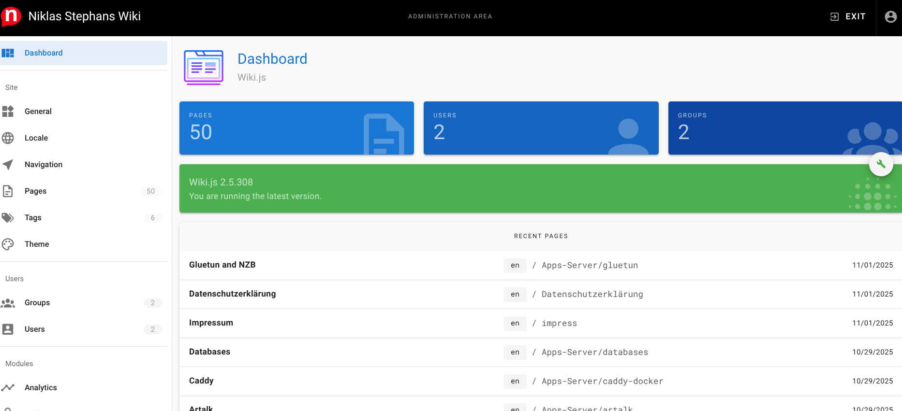

# 📖 Wiki.js

:::warning
Diese Applikation nutze ich nicht mehr, und nehme stattdessen nun [Outline](/doc/wiki-outline-4lnSeNotaY).

:::

 


Wiki.js ist Backend und Frontend für euer Wiki


# Installation


## Volumes

```bash
mkdir db
mkdir key
mkdir repo
```

## compose.yml

```yaml
services:
  db:
    container_name: wikijsdb
    image: postgres:18-alpine
    user: "1000:1000"
    environment:
      POSTGRES_DB: ${POSTGRES_DB}
      POSTGRES_PASSWORD: ${POSTGRES_PASSWORD}
      POSTGRES_USER: ${POSTGRES_USER}
      PUID: ${PUID}
      PGID: ${PGID}
      TZ: ${TZ}
    restart: unless-stopped
    shm_size: 128mb
    volumes:
      - ./db:/var/lib/postgresql/18/docker
    networks:
      default:
  wiki:
    container_name: wikijsapp
    image: ghcr.io/requarks/wiki:2
    depends_on:
      - db
    environment:
      DB_TYPE: postgres
      DB_HOST: db
      DB_PORT: 5432
      DB_USER: ${POSTGRES_USER}
      DB_PASS: ${POSTGRES_PASSWORD}
      DB_NAME: ${POSTGRES_DB}
      PUID: ${PUID}
      PGID: ${PGID}
      TZ: ${TZ}
    volumes:
      - ./key/id_rsa:/etc/wiki/github.pem
      - ./repo:/wiki/data/repo
    restart: unless-stopped
    networks:
      default:
      caddy:
networks:
    caddy:
        external: true

#
```


## .env

```bash
POSTGRES_DB=wiki
POSTGRES_PASSWORD=wtf#4993
POSTGRES_USER=wikiwtf
PUID=1000
PGID=1000
TZ=Europe/Berlin
```


# Betrieb

```bash
ssh-keygen -t rsa -b 4096
```

# Alternativen

* Outline

# Quellen / Links

* <https://js.wiki>